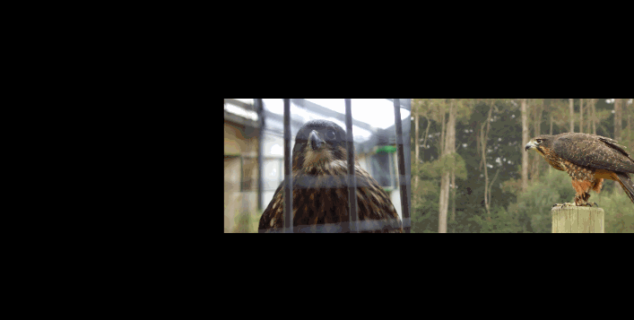

#SMMosaicCollectionView
---------------

Purpose
--------------

There are a few discussions about how to build a scrollview with variable page sizes. When faced with this problem I decided to complete my own specific implementation. 

Required:  

* Multiple images displayed side-by-side regardless of size.
* Bounce to the center most image on decelleration and stop.
* Lightweight.

### Best seen in the following example

What next?
-----------------------------

I would love to see where this library goes. I've kept it simple to start off with but intend on updating as I work through its implementation in my own app.

Release Notes
--------------

Version 1.0

* Initial release